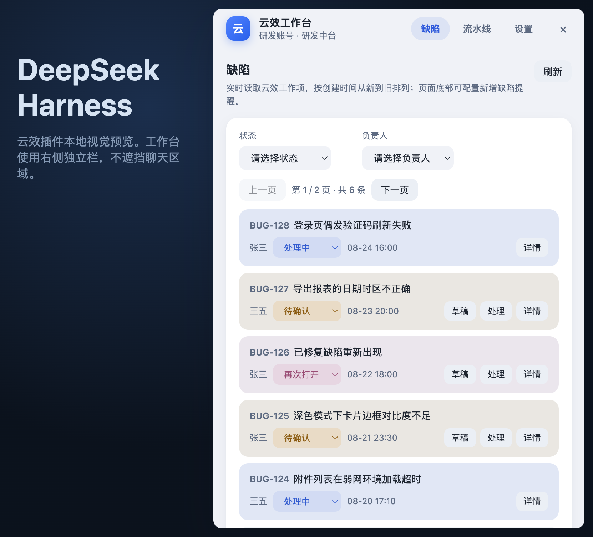
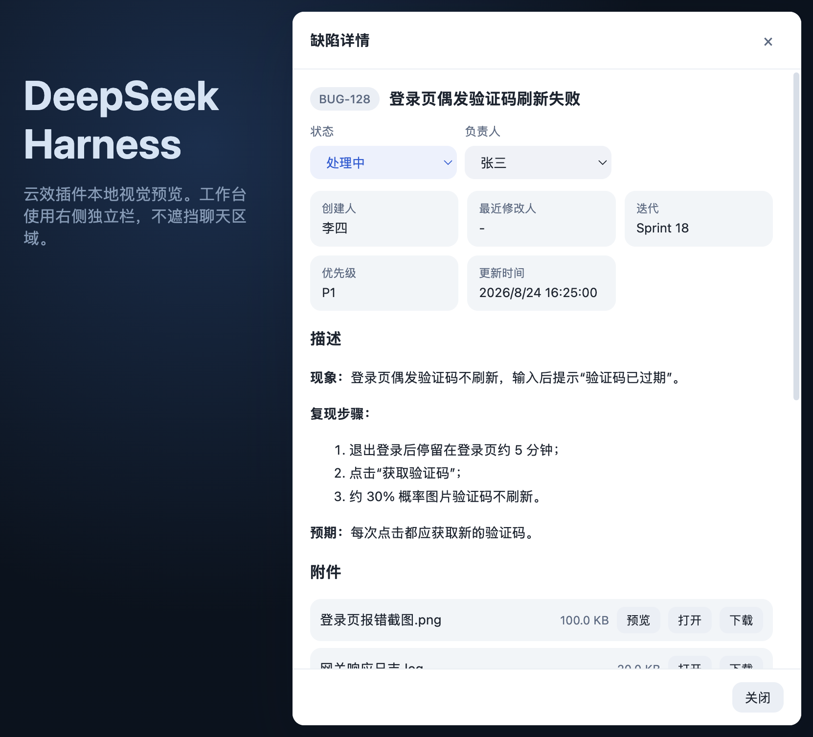
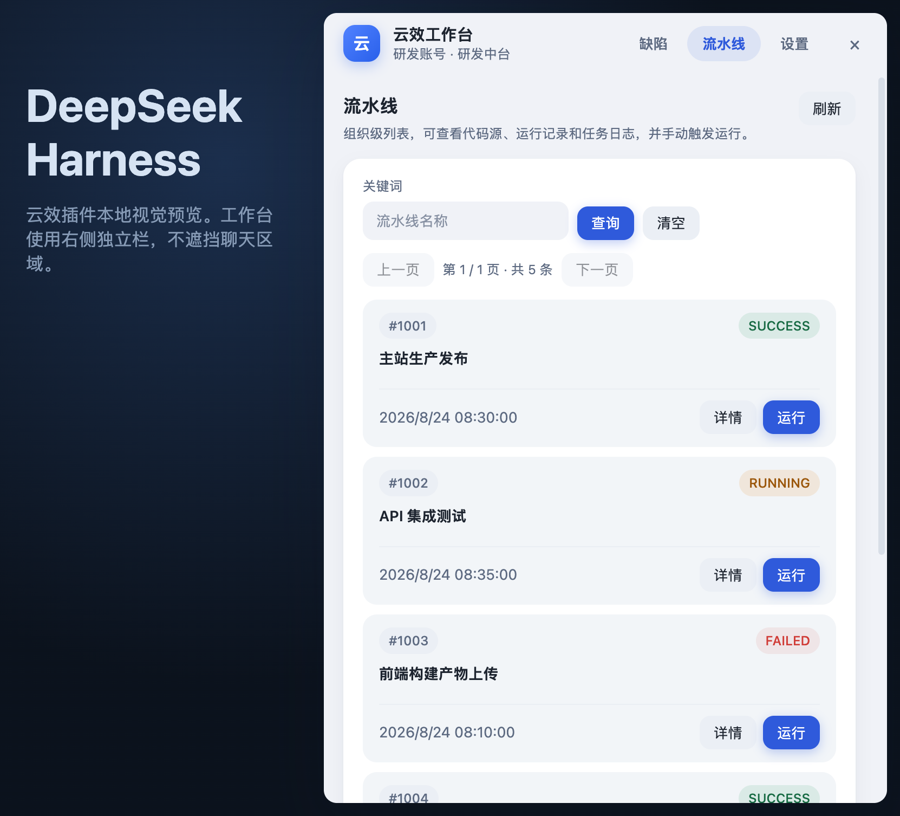
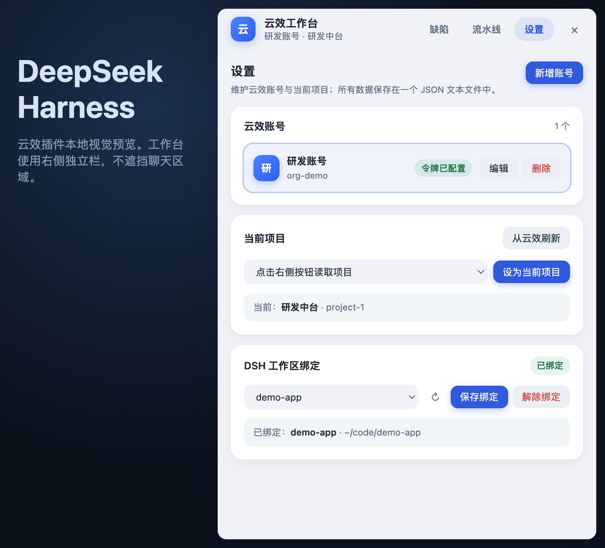

# dsh-yunxiao

适用于 [DeepSeek Harness](https://deepseek-harness.github.io/deepseek-harness/develop/basic/) 的轻量云效（阿里云 DevOps）工作台插件：管理云效账号与项目、处理缺陷、查看与运行流水线。配置与缓存保存在一个 JSON 文本文件中，无需数据库，也不接收消息回调或 Webhook。

语言 / Language: [中文](#中文) | [English](#english)

---

## 中文

### 界面预览

工作台集成在 Harness 侧栏，固定于右侧独立栏打开，不遮挡聊天区域，左边缘可拖拽调整宽度。以下截图均为本地预览构造的演示数据。



缺陷详情支持直接修改状态与负责人，查看描述、评论与附件，并以当前账号发布评论：



| 流水线 | 设置 |
| --- | --- |
|  |  |

### 功能

- **缺陷**：按创建时间分页展示，按状态/负责人筛选；列表与详情中可直接修改状态与负责人；“待确认/再次打开”等状态的缺陷卡片使用柔和差异色；支持发布评论、查看/下载附件，描述与附件中的图片支持全屏预览、复制与下载（桌面端经宿主写入系统剪贴板，无跨域限制）；
- **一键处理**：“待确认”“再次打开”的缺陷可一键“草稿/处理”到项目绑定的 DSH 工作区：草稿填入会话输入框不发送，处理直接创建会话发送，并自动带入缺陷标题与图片附件；
- **缺陷通知**：按项目开启系统原生通知（Windows Toast / macOS 通知中心），可指定负责人与轮询间隔；侧栏角标与未处理数一致，处理后自动清零；
- **流水线**：组织级列表、详情、代码源与分支、运行记录、阶段/任务与日志查看，支持手动运行并选择 Codeup 分支；
- **设置**：维护多个云效组织与个人访问令牌，切换当前账号与项目，为项目绑定 DSH 工作区；
- **模型工具**：`yunxiao_list_defects`、`yunxiao_list_pipelines` 两个只读工具，默认读取工作台的当前账号与项目；
- **离线回退**：项目、缺陷与流水线列表写入文本缓存，OpenAPI 暂时失败时展示缓存并标记时间。

### 安装

在仓库根目录执行：

```powershell
dsh plugin --profile web add -w .

# 校验组合配置中出现 dsh-yunxiao
dsh --profile web --dump-config
```

安装或重新安装后，重启正在运行的 Harness Web/Desktop 实例即可在左侧栏底部看到“云效工作台”入口。

### 文档

完整的功能清单、数据存储与令牌安全说明、云效令牌权限、配置覆盖与开发验证步骤见 [d_yunxiao/README.md](./docs/README.md)。

---

## English

A lightweight Yunxiao (Alibaba Cloud DevOps) workbench plugin for [DeepSeek Harness](https://deepseek-harness.github.io/deepseek-harness/develop/basic/): manage Yunxiao accounts and projects, handle defects, and inspect/run pipelines. Configuration and cache live in a single JSON text file — no database, no message callbacks or webhooks.

### Screenshots

The workbench is integrated into the Harness sidebar and opens in a dedicated right-hand column, keeping the chat area unobstructed; drag its left edge to resize. All screenshots use fictional demo data built by the local preview harness.


The defect detail view lets you change status and assignee inline, read the description, comments and attachments, and post comments as the current account:


| Pipelines | Settings |
| --- | --- |
|  |  |

### Features

- **Defects**: paginated by creation time with status/assignee filters; change status and assignee inline from the list or detail view; soft accent colors highlight pending/reopened cards; post comments, view and download attachments; images in descriptions/attachments support fullscreen preview, copy and download (the desktop app writes to the system clipboard via the host, with no cross-origin restrictions);
- **One-click handoff**: defects in “Pending confirmation / Reopened” status can be handed off to the project's bound DSH workspace as a “Draft” (fills the session input without sending) or “Handle” (creates and sends a new session), carrying the defect title and image attachments;
- **Defect notifications**: per-project native system notifications (Windows Toast / macOS Notification Center) with an optional assignee filter and polling interval; the sidebar badge mirrors the unhandled count and clears after handling;
- **Pipelines**: organization-level list, details, code sources and branches, run history, stage/job logs, and manual runs with Codeup branch selection;
- **Settings**: manage multiple Yunxiao organizations and personal access tokens, switch the current account and project, and bind a DSH workspace per project;
- **Model tools**: two read-only tools, `yunxiao_list_defects` and `yunxiao_list_pipelines`, defaulting to the workbench's current account and project;
- **Offline fallback**: projects, defects and pipeline lists are cached to text files and shown (with a timestamp) when the OpenAPI is temporarily unavailable.

### Installation

Run from the repository root:

```powershell
dsh plugin --profile web add -w .

# Verify dsh-yunxiao appears in the composed config
dsh --profile web --dump-config
```

After installing (or reinstalling), restart the running Harness Web/Desktop instance; the “云效工作台” (Yunxiao Workbench) entry appears at the bottom of the left sidebar.

### Documentation

For the full feature list, data storage and token security notes, Yunxiao token permissions, config overrides and development verification, see [d_yunxiao/README.md](./docs/README.md).
